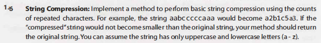
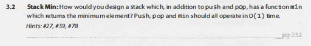
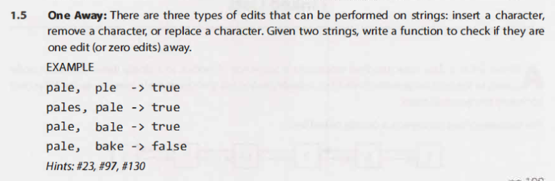

# CIP Puzzles

## String Compression

[Code](https://github.com/3salaz/cip-javascript-puzzles/blob/master/stringCompression.js)

**Breakdown**

> _Loop Through String_

> _Check if string character is the same as the next string character_

> _Add num of times char repeat?_

> _Add current char to new string_

> Add num of times re

## Stack Of Plates

   

[Code](https://github.com/3salaz/cip-javascript-puzzles/blob/master/stackOfPlates.js)

## Return Kth To Last

   

[Code](https://github.com/3salaz/cip-javascript-puzzles/blob/master/returnKthToLast.js)

## Stack Min

   

[Code](https://github.com/3salaz/cip-javascript-puzzles/blob/master/stackMin.js)

## One Away

   

[Code](https://github.com/3salaz/cip-javascript-puzzles/blob/master/oneAway.js)
